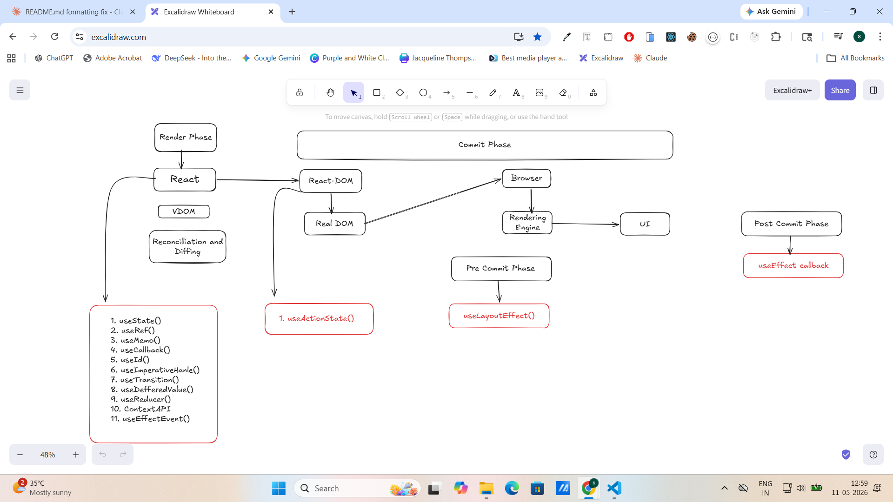

# React Notes

---

## Table of Contents

1. [What is React and its Features?](#1-what-is-react-and-its-features)
2. [Why Use React When We Have HTML, CSS, and JS?](#2-why-use-react-when-we-have-html-css-and-js)
3. [What is JSX? Rules to Write JSX](#3-what-is-jsx-rules-to-write-jsx)
4. [What is a Component in React? Types of Components](#4-what-is-a-component-in-react-types-of-components)
5. [What is React.Fragment and Empty Fragment?](#5-what-is-reactfragment-and-empty-fragment)
6. [What is Component Composition?](#6-what-is-component-composition)
7. [What is Props?](#7-what-is-props)
8. [What is Default Props?](#8-what-is-default-props)
9. [Why We Use Props / Characteristics of Props](#9-why-we-use-props--characteristics-of-props)
10. [What is Children Prop?](#10-what-is-children-prop)
11. [What is Props Drilling?](#11-what-is-props-drilling)
12. [What is Render Prop?](#12-what-is-render-prop)
13. [What is Synthetic Event in React?](#13-what-is-synthetic-event-in-react)
14. [What is Virtual DOM?](#14-what-is-virtual-dom)
15. [What is Reconciliation?](#15-what-is-reconciliation)
16. [What is Diffing Algorithm?](#16-what-is-diffing-algorithm)
17. [What is Render Phase?](#17-what-is-render-phase)
18. [What is Commit Phase?](#18-what-is-commit-phase)
19. [What is State?](#19-what-is-state)
20. [Difference Between State and Props](#20-difference-between-state-and-props)
21. [What is Hooks?](#21-what-is-hooks)
22. [What is useState Hook?](#22-what-is-usestate-hook)
23. [What is Batching?](#23-what-is-batching)
24. [What is Conditional Rendering?](#24-what-is-conditional-rendering)
25. [Lazy Initialization in useState](#25-lazy-initialization-in-usestate)
26. [What is useEffect?](#26-what-is-useeffect)
27. [Difference Between useState and useEffect](#27-difference-between-usestate-and-useeffect)
28. [React Lifecycle Methods in Function Based Component](#28-react-lifecycle-methods-in-function-based-component)
29. [What is a Single Page Application (SPA)?](#29-what-is-a-single-page-application-spa)
30. [What is a Multi Page Application (MPA)?](#30-what-is-a-multi-page-application-mpa)
31. [Difference Between SPA and MPA](#31-difference-between-spa-and-mpa)
32. [What is Client Side Routing?](#32-what-is-client-side-routing)
33. [What is Server Side Routing?](#33-what-is-server-side-routing)
34. [What is react-router-dom?](#34-what-is-react-router-dom)
35. [createBrowserRouter vs BrowserRouter](#35-createbrowserrouter-vs-browserrouter)
36. [Difference Between Link and NavLink](#36-difference-between-link-and-navlink)
37. [What is Outlet?](#37-what-is-outlet)
38. [What is Index Prop?](#38-what-is-index-prop)

---

## 1. What is React and its Features?

> _(To be filled)_

---

## 2. Why Use React When We Have HTML, CSS, and JS?

> _(To be filled)_

---

## 3. What is JSX? Rules to Write JSX

**JSX** stands for **JavaScript XML**. It is a syntax extension for JavaScript that allows you to write HTML-like code inside JavaScript files. It was introduced by Facebook (Meta) for React.

### Rules

| #   | Rule                                                                       |
| --- | -------------------------------------------------------------------------- |
| 1   | Return only **one parent element**                                         |
| 2   | All tags (including self-closing) must be **properly closed**              |
| 3   | Use **camelCase** for attributes (e.g., `onClick`, `onChange`)             |
| 4   | JavaScript expressions go inside `{}`                                      |
| 5   | Comments use `{/* */}` syntax                                              |
| 6   | No `if-else` directly inside JSX; use **ternary** or **logical operators** |
| 7   | Use `className` instead of `class`                                         |
| 8   | Use `htmlFor` instead of `for` in `<label>` tags                           |

---

## 4. What is a Component in React? Types of Components

A **component** in React is a reusable, self-contained piece of code that returns JSX.

### Types

#### 1. Class Based Component (CBC)

- A JavaScript class that extends `React.Component`
- Has a `render()` method to return JSX
- Traditional way of writing components (before 2019)

#### 2. Function Based Component (FBC)

- A simple JavaScript function that returns JSX
- Recommended and most popular way in modern React

---

## 5. What is React.Fragment and Empty Fragment?

| Type                        | Description                                                                                                  |
| --------------------------- | ------------------------------------------------------------------------------------------------------------ |
| `React.Fragment`            | A wrapper component that groups multiple elements without adding an extra DOM node. Supports the `key` prop. |
| `<>...</>` (Empty Fragment) | Shorthand for `React.Fragment`. Does the same thing but does **not** support the `key` prop.                 |

> **Note:** Neither fragment supports `id` or `className` attributes.

---

## 6. What is Component Composition?

**Component Composition** is the practice of calling one component inside another component.

```jsx
function Header() {
  return <h1>Welcome</h1>;
}

function App() {
  return (
    <div>
      <Header /> {/* Header component called inside App */}
    </div>
  );
}
```

---

## 7. What is Props?

**Props** (short for "properties") are a mechanism used to pass data from one component to another, in a **unidirectional (top-down)** flow from parent to child.

```jsx
// Parent passes props
<Greeting name="Alice" age={25} />;

// Child receives and uses them
function Greeting({ name, age }) {
  return (
    <h1>
      Hello, {name}! You are {age} years old.
    </h1>
  );
}
```

---

## 8. What is Default Props?

**Default props** allow you to define fallback values for a component's props when none are passed.

```jsx
function Greeting({ name = "Guest", age = 18 }) {
  return (
    <h1>
      Hello, {name}! You are {age} years old.
    </h1>
  );
}

// Called without any props
<Greeting />;
// Output: Hello, Guest! You are 18 years old.
```

---

## 9. Why We Use Props / Characteristics of Props

### Characteristics

| Property           | Description                                                      |
| ------------------ | ---------------------------------------------------------------- |
| **Immutable**      | A child component cannot modify its own props                    |
| **Unidirectional** | Data flows only from parent to child                             |
| **Any type**       | Strings, numbers, arrays, objects, functions, even JSX           |
| **Destructured**   | Commonly destructured in the function signature for cleaner code |

### Use Cases

- **Pass Data** - Send data from parent to child
- **Reusability** - Same component reused with different data
- **Dynamic Content** - Components show different content based on props
- **Avoid Repetition** - Write once, reuse anywhere
- **Communication** - The only way for a parent to communicate with a child

---

## 10. What is Children Prop?

`props.children` is a special, built-in prop that lets you pass content between the opening and closing tags of a component.

- Anything placed inside a component's tags is automatically passed as `props.children`
- Children can be strings, numbers, JSX elements, arrays, or even functions

```jsx
function Card({ children }) {
  return <div className="card">{children}</div>;
}

// Usage
<Card>
  <h2>Title</h2>
  <p>Description here</p>
</Card>;
```

---

## 11. What is Props Drilling?

**Prop Drilling** is the process of passing data (props) through multiple layers of components to reach a deeply nested child that needs it, even if the intermediate components do not use that data.

> **To avoid prop drilling:** Use **Context API** or React state management libraries (Redux, Zustand, etc.)

```jsx
// Data starts here in Parent
function Parent() {
  const name = "Alice";
  const age = 25;
  return (
    <div>
      <h1>I am Parent</h1>
      <Child name={name} age={age} />
    </div>
  );
}

// Child receives and passes down to SubChild
function Child({ name, age }) {
  return (
    <div>
      <h2>I am Child</h2>
      <SubChild name={name} age={age} />
    </div>
  );
}

// SubChild finally uses the data
function SubChild({ name, age }) {
  return (
    <div>
      <h3>I am SubChild</h3>
      <p>Name: {name}</p>
      <p>Age: {age}</p>
    </div>
  );
}
```

---

## 12. What is Render Prop?

A **Render Prop** is when you pass a function as a prop to a component, and that component calls the function to render something.

```jsx
// Component accepts a function as a prop
function Greet({ render }) {
  return <div>{render("Alice")}</div>; // calls the function
}

// Passing a function as a prop
<Greet render={(name) => <h1>Hello, {name}!</h1>} />;

// Output: Hello, Alice!
```

---

## 13. What is Synthetic Event in React?

A **Synthetic Event** is a cross-browser wrapper around the browser's native event object.

- React normalizes events so they behave identically across all browsers
- Instead of a raw `MouseEvent` or `KeyboardEvent`, you get a `SyntheticEvent` object
- Has the same interface: `preventDefault()`, `stopPropagation()`, `target`, `currentTarget`, etc.

---

## 14. What is Virtual DOM?

The **Virtual DOM (VDOM)** is a lightweight, in-memory JavaScript representation (a tree of JavaScript objects) of the Real DOM.

- Instead of updating the Real DOM on every change, React maintains a virtual copy in memory
- On re-render, React creates a new virtual tree and **compares it with the previous one** to optimize DOM updates

---

## 15. What is Reconciliation?

**Reconciliation** is the process React uses to figure out how to efficiently update the DOM when changes occur in the UI.

---

## 16. What is Diffing Algorithm?

The **Diffing Algorithm** is React's heuristic-based `O(n)` comparison algorithm that efficiently finds differences between the new and old Virtual DOM trees.

---

## 17. What is Render Phase?

The **Render Phase** is the **first phase** of React's reconciliation process.

- React invokes the component functions (or `render()` in class components)
- Creates a new Virtual DOM tree
- Performs diffing to determine the minimal set of changes needed

**Key properties:**

- Pure and side-effect free
- React may pause, abort, or restart this phase (due to concurrent rendering in React 18+)
- No DOM mutations or side effects should occur here



---

## 18. What is Commit Phase?

The **Commit Phase** is the **second and final phase** of React's reconciliation process. React applies the calculated changes (mutations) to the real DOM in a single, synchronous batch.

- Runs after the Render Phase is complete
- Side effects are executed here:
  - `useLayoutEffect()` runs **before** browser paint
  - `useEffect()` runs **after** browser paint

---

## 19. What is State?

**State** in React is an internal, mutable data structure that represents the dynamic data of a component.

- Whenever a state variable changes, React **re-renders** the component

---

## 20. Difference Between State and Props

| Aspect     | Props                                 | State                                       |
| ---------- | ------------------------------------- | ------------------------------------------- |
| Mutability | Immutable                             | Mutable                                     |
| Purpose    | Pass data between components          | Manage internal component data              |
| Ownership  | Owned and controlled by parent        | Owned by the component that declares it     |
| Updates    | Child cannot modify props             | Component can read and update its own state |
| Re-render  | Does not trigger re-render on its own | State update triggers re-render             |

---

## 21. What is Hooks?

**Hooks** are special built-in functions in React that allow you to use state and other React features (like lifecycle methods, context, refs, etc.) in **functional components**.

### Key Features

- Introduced in **React 16.8**
- Allow Functional Components to be stateful
- Always start with `"use"` (e.g., `useState`, `useEffect`)
- Enable better code reuse

---

## 22. What is useState Hook?

`useState` is a built-in React Hook that allows you to add and manage local state in functional components. It returns an array with two elements: the current state value and a function to update it.

### Syntax

```js
const [state, setState] = useState(initialValue);
```

| Element        | Description                                                         |
| -------------- | ------------------------------------------------------------------- |
| `state`        | Current value of the state (read-only)                              |
| `setState`     | Function used to update the state                                   |
| `initialValue` | Initial value (can be number, string, boolean, object, array, etc.) |

---

## 23. What is Batching?

**Batching** in React is the process where React groups multiple state updates into a **single re-render** instead of re-rendering after every individual state update.

- Improves performance by reducing unnecessary re-renders

---

## 24. What is Conditional Rendering?

**Conditional Rendering** is the technique of rendering different UI elements or components based on certain conditions.

- Uses `if-else`, ternary operator `? :`, or logical (short-circuit) operator `&&`

---

## 25. Lazy Initialization in useState

**Lazy Initialization** is a technique where you pass a **function** as the initial value to `useState`. React calls this function only **once** during the initial render and uses its return value as the initial state.

This is useful for expensive computations that should not run on every re-render.

### Syntax

```js
const [state, setState] = useState(() => {
  // This function runs ONLY ONCE during initial render
  return expensiveComputation();
});
```

---

## 26. What is useEffect?

The `useEffect` hook is a built-in React function that allows you to perform **side effects** in functional components.

Side effects are operations that interact with systems outside of React (e.g., API calls, DOM manipulation, timers).

### Variants

#### 1. No dependency array - runs after every render

```js
useEffect(() => {
  console.log("Runs after every render");
});
```

#### 2. Empty dependency array - runs once on mount

```js
useEffect(() => {
  console.log("Runs once, like componentDidMount");
}, []);
```

#### 3. With dependencies - runs when those values change

```js
useEffect(() => {
  console.log("Runs when count or name changes");
}, [count, name]);
```

---

## 27. Difference Between useState and useEffect

| Aspect             | useState                         | useEffect                                          |
| ------------------ | -------------------------------- | -------------------------------------------------- |
| Purpose            | Add and manage state (data)      | Perform side effects                               |
| Returns            | `[currentState, setState]` array | `undefined` (nothing)                              |
| Triggers re-render | Yes, when `setState` is called   | No                                                 |
| Timing             | Synchronous during render        | Runs after render (and after paint)                |
| Common use         | Storing dynamic values           | API calls, subscriptions, timers, DOM manipulation |

---

## 28. React Lifecycle Methods in Function Based Component

Every React component goes through 3 phases:

```
MOUNT  -->  UPDATE  -->  UNMOUNT
(born)     (changes)     (dies)
```

### Phase 1: Mounting

Component is created and inserted into the DOM for the first time.

```js
useEffect(() => {
  console.log("Runs once after component mounts");
}, []);
```

### Phase 2: Updating

Component re-renders due to state or prop changes.

```js
useEffect(() => {
  console.log("Runs when count or name changes");
}, [count, name]);
```

### Phase 3: Unmounting

Component is removed from the DOM. The **cleanup function** runs at this point.

```js
useEffect(() => {
  console.log("Effect runs");

  return () => {
    console.log("Cleanup: component unmounted"); // Runs on unmount
  };
}, []);
```

---

## 29. What is a Single Page Application (SPA)?

A **Single Page Application** is a web app that loads a **single HTML document** and dynamically updates the DOM using JavaScript, instead of requesting new pages from the server on each navigation.

---

## 30. What is a Multi Page Application (MPA)?

A **Multi-Page Application** is a traditional web architecture where every user interaction (clicking a link, submitting a form) triggers a **full browser refresh** to load a completely new HTML page from the server.

---

## 31. Difference Between SPA and MPA

| Aspect       | SPA                  | MPA                          |
| ------------ | -------------------- | ---------------------------- |
| Page Loads   | One initial load     | Full reload per page         |
| Performance  | Faster navigation    | Slower navigation            |
| SEO          | Harder (needs SSR)   | Naturally good               |
| Development  | Usually one codebase | Traditional (multiple pages) |
| Initial Load | Slightly high        | Low                          |

---

## 32. What is Client Side Routing?

**Client-side routing** is when navigation between pages is handled by **JavaScript in the browser**. Instead of requesting a new page from the server, JavaScript libraries (like React Router, Vue Router) update the URL using the History API and render the appropriate component without reloading the page.

---

## 33. What is Server Side Routing?

**Server-side routing** is the traditional method where the browser sends a request to the server for every new URL. The server generates and sends back a complete HTML page, causing a **full browser refresh**.

---

## 34. What is react-router-dom?

**React Router DOM** is a popular library for client-side routing in React applications. It allows you to create a Single Page Application (SPA) and navigate between views without full page reloads.

---

## 35. createBrowserRouter vs BrowserRouter

### createBrowserRouter

- A function introduced in **React Router v6.4+**
- Creates a router instance using the History API
- **Recommended** approach
- Supports data APIs like `loaders`, `actions`, and `fetchers`

### BrowserRouter

- A component that wraps your app and enables client-side routing using the History API
- Does **not** support React Router v6.4+ data APIs like loaders and actions

---

## 36. Difference Between Link and NavLink

### Link

- Renders an anchor tag and navigates to a route without a full page reload
- Used for general navigation (e.g., "Read More" button, footer links)

### NavLink

- Same as `Link` but **applies an active class** when its route matches the current URL
- Used in Navbars or Dashboard tabs

---

## 37. What is Outlet?

`<Outlet />` is a component used in parent routes that acts as a **placeholder** where the matched child route's component gets rendered.

```jsx
function Dashboard() {
  return (
    <div>
      <h1>Dashboard</h1>
      <Outlet /> {/* child route renders here */}
    </div>
  );
}
```

---

## 38. What is Index Prop?

The `index` prop is a boolean on a route that marks it as the **default child route**, rendered inside the parent's `<Outlet />` when no other child route matches.

```jsx
const router = createBrowserRouter([
  {
    path: "/dashboard",
    element: <Dashboard />,
    children: [
      { index: true, element: <DashboardHome /> }, // renders at /dashboard
      { path: "settings", element: <Settings /> }, // renders at /dashboard/settings
    ],
  },
]);
```

---

## Test 2 - Question Bank

> Attempt any **11 questions**. Question 12 is **compulsory**.

1. What is VDOM, Reconciliation, and Diffing Algorithm?
2. What is Render Phase and Commit Phase?
3. What is State? Difference between State and Props?
4. What is Hooks? Explain useState Hook with syntax.
5. Can we write a function as an initial value in `useState`? (Lazy Initialization)
6. What is Batching and Conditional Rendering?
7. What is the `useEffect` Hook? Difference between `useState` and `useEffect`.
8. What is the React Lifecycle Method in Function Based Components?
9. Difference between SPA and MPA?
10. Difference between Client Side Routing and Server Side Routing?
11. What is the Key prop? When should we use index as a key prop?
12. **(Compulsory)** Explain the following terms:
    1. `createBrowserRouter`
    2. `BrowserRouter`
    3. `Link` vs `NavLink`
    4. `Index Prop`
    5. `Outlet`

---

## 39. What is useNavigate Hook?
- useNavigate is a hook that returns a navigate function used to navigate to different routes in your app.
- It replaces the old useHistory hook and allows navigation with options like replace, state, or delta 
#### Example
```
    navigate('/dashboard', { replace: true })).
```
## 40. How to create 404 not Found page?
A 404 Not Found page is an error page that appears when a user tries to access a URL/route that doesn't exist on your website or application.
```
const router = createBrowserRouter([
  // Explicit 404 route
  {
    path: "*",
    element: <NotFound />,
  },
]);
```

## 41. What is Dynamic Routing?
- Dynamic Routing is a technique where routes are defined with dynamic segments (parameters) so that a single route can handle multiple URLs.

#### Example
```
      const router = createBrowserRouter([
        { path: "/", element: <Home /> },
        { path: "/notes/:id", element: <NoteDetail /> },   // Dynamic Route
        { path: "*", element: <NotFound /> }
      ]);
```


## 42. What is useParams Hook?
- useParams is a React Router hook that lets you access dynamic values from the URL.
- If your route is /notes/:id, then useParams() gives you the id value.

#### Syntax
```
  const { id } = useParams();
```

## 43. What is Navigate Component? Difference between Navigate vs useNavigate?
Navigate is a React Router component used to redirect users to another route declaratively when it is rendered.

### Navigate Componentuse
 - It is a React component used for declarative redirection.
 - It is mainly used for automatic redirects

### useNavigate Hook
- It is a React hook that returns a function to navigate programmatically.
- It is used inside event handlers like button clicks, form submissions, or after async operations.

## 44. What is useSearchParams Hook?
- useSearchParams is a React Router hook used to read and update the query parameters (search params) in the URL.
- It returns an array with the current search params object and a function to update.

#### Example
```
import { useSearchParams } from 'react-router-dom';

function Component() {
  const [searchParams, setSearchParams] = useSearchParams();

  // Read
  const page = searchParams.get('page');
  const filter = searchParams.get('filter');

  // Update
  const handleFilter = () => {
    setSearchParams({ filter: 'active', page: 1 });
  };

  return <div>...</div>;
}
```


## 45. Difference between useParams and useSearchParams?

### useParams Hook:

- It is used to access dynamic route parameters defined in the URL path.
- Works with routes like /users/:id or /notes/:noteId.
- Returns a simple object (e.g., { id: "45" }).
- Mainly used for unique page identification.

### useSearchParams Hook:

- It is used to read and modify query parameters (search params) in the URL.
- Works with URLs like /notes?search=react&page=2.
- Returns an array [searchParams, setSearchParams].
- Mainly used for filtering, searching, sorting, and pagination.

## 46. What is useRouteError Hook?
- useRouteError is a React Router hook that returns the error thrown while rendering, loading, or navigating to a route.
- It is used only inside an errorElement to display error messages to the user.

#### syntax
```
import { useRouteError } from 'react-router-dom';

function ErrorPage() {
  const error = useRouteError();

  return (
    <div>
      <h1>Oops! Something went wrong</h1>
      <p>{error.status} - {error.statusText}</p>
      <p>{error.data || error.message}</p>
    </div>
  );
}
```

## 47. What is useLoaderData Hook?
- useLoaderData is a React Router hook that allows you to access the data returned by the loader function of the current route.
- It is used for data fetching before a component renders (great for SEO and performance).

#### syntax
```
import { useLoaderData } from 'react-router-dom';

function NoteDetail() {
  const note = useLoaderData();     // Get data from loader

  return (
    <div>
      <h1>{note.title}</h1>
      <p>{note.body}</p>
    </div>
  );
}
```


## 48. What is useOutletContext Hook?
- useOutletContext is a React Router hook that allows nested child routes to access data/context passed from their parent route.
- It helps in sharing data between parent and child components without using prop drilling.

#### syntax
```
 // Child Component
import { useOutletContext } from 'react-router-dom';

function ChildPage() {
  const context = useOutletContext();   // Get data from parent
  
  return <h1>{context.userName}</h1>;
}

// Parent Route
function Layout() {
  const user = { userName: "Chombu", role: "admin" };

  return <Outlet context={user} />;   // Passing data
}
```
## 49. What is Public Route?
A Public Route is a route that can be accessed by anyone, whether the user is logged in or not.

## 50. What is Protected Route?
A Protected Route is a route that can only be accessed by authenticated users (logged-in users).


## 51. What is CORS?
- CORS stands for Cross-Origin Resource Sharing.
- It is a security mechanism implemented by web browsers that allows or restricts web pages from making requests to a different domain
- Without proper CORS policy on the backend, the browser will block the request and show an error.

## 52. What is CORS Policy?
- CORS Policy is a set of rules defined by the server that tells the browser whether it should allow or block a cross-origin request.
-It is sent by the server in the form of special HTTP headers (like Access-Control-Allow-Origin).

## 53. Why Does CORS Exist?
- Browsers follow the Same-Origin Policy (security feature) by default, which blocks requests from one domain to another to prevent malicious websites from accessing sensitive data.
- CORS is the controlled way to relax that restriction.


## 54. How to fix CORS? 
#### Step-1: Install cors package
```
 npm install cors
```
#### Step-2: Use cors in backend
```
import cors from "cors";

app.use(cors({
  origin: ['http://localhost:3000', 'http://localhost:5173'],   // your frontend URLs
  credentials: true,                                            // if using cookies/auth
  methods: ['GET', 'POST', 'PUT', 'DELETE', 'OPTIONS'],         // Allowed Methods             
  allowedHeaders: ['Content-Type', 'Authorization']             // Allowed headers
}));
```


- useLoaderData
- useRouteError
- useOutletContext
- useActionData (Monday)
